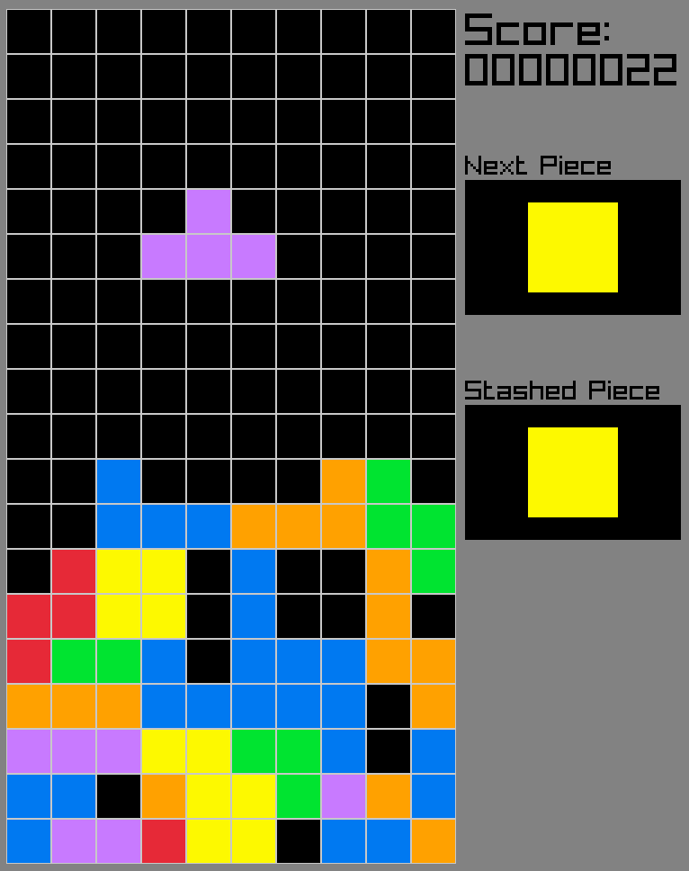

# CPP Tetris

## About th is repo

Just to learn C++, the game is incomplete and has known bugs.



Features :
* No loose condition, you're always a winner
* Move with the usual vim bindings (though arrows are also acceptable).
* Rotate couter-clockwise / clockwise with : 'D' and 'F'
* Stash / swap current piece :  'S'
* 'Esc' to quit (':q' not implemented yet)
* No wall kickback, seemed like a lot of work
* There might be a bug that I don't remember if fixed, for you to discover
* Space to yeet the piece down
* Matrix multiplication for the rotation, except for 'I' piece
* Code Free of Templates

## Install dependencies

Dependencies for Raylib :
```bash
sudo apt install libasound2-dev libx11-dev libxrandr-dev libxi-dev libgl1-mesa-dev libglu1-mesa-dev libxcursor-dev libxinerama-dev libwayland-dev libxkbcommon-dev
```

Raylib Itself :
```bash
wget https://github.com/raysan5/raylib/releases/download/5.0/raylib-5.0_linux_amd64.tar.gz
tar xzf raylib-5.0_linux_amd64.tar.gz

mv raylib-5.0_linux_amd64/ external/raylib
```


## Build && Run

```bash
mkdir -p bulid && cd build
cmake .. && make
./CppTetris
```
